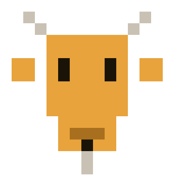
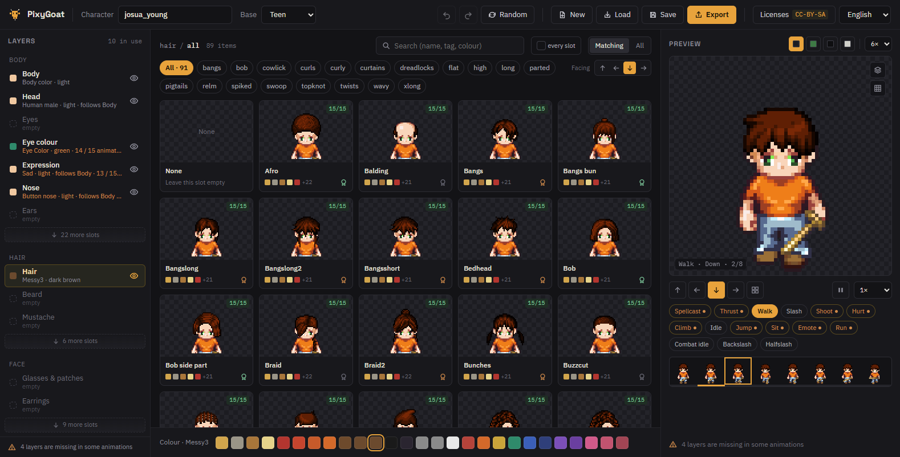
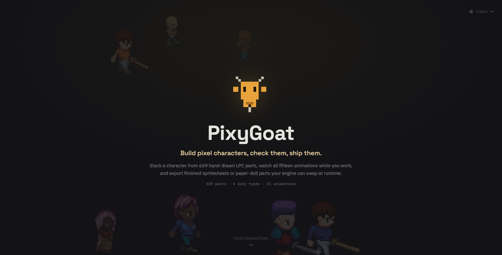

<div align="center">



# PixyGoat

**Build pixel characters, check them, ship them.**

Stack a character from 659 hand-drawn [LPC](https://lpc.opengameart.org/) parts,
watch all fifteen animations while you work, and export finished spritesheets or
paper-doll parts your engine can swap at runtime.
Runs on your own machine, in your own browser.


</div>



## What it does

- **Every part, filtered to what fits.** 659 parts across 6 body types. The
  catalogue greys out what your body type cannot wear instead of hiding it, and
  says which body type it belongs to when it collides.
- **Fifteen animations while you work.** Walk, run, the four attack sets,
  climbing, sitting — playing in the preview as you pick, with the frame strip
  underneath and any facing you like.
- **Licences you can read.** Every part carries a seal: may you sell it, must
  you credit, must changes stay open. Filter the catalogue down to terms you
  accept, and every export writes a matching `CREDITS.txt`.
- **Exports that keep working.** Flat spritesheets for prototypes, or
  paper-doll parts with a manifest so an engine can swap hair and weapons at
  runtime without a clip per garment.

## Quick start

```bash
npm install
npm start
```

Then open <http://127.0.0.1:4600>. The first start scans the spritesheet folder
— about a minute for 300 000 files — and caches the catalogue in `.cache/`.
Later starts take a few seconds.



You need **Node.js 22 or newer** and the LPC `spritesheets/` folder next to this
README, or anywhere else with `--sprites <path>`. It has to be the snapshot of
the generator repository from 2025-07-21, commit `e7fa0aee616`.

<details>
<summary>Flags and environment variables</summary>

| Flag | Variable | Default |
|---|---|---|
| `--sprites <dir>` | `PIXYGOAT_SPRITES` | `./spritesheets` |
| `--port <n>` | `PIXYGOAT_PORT` | `4600` |
| `--host <addr>` | `PIXYGOAT_HOST` | `127.0.0.1` |
| `--characters <dir>` | `PIXYGOAT_CHARACTERS` | `./characters` |
| `--cache <dir>` | `PIXYGOAT_CACHE` | `./.cache` |
| | `PIXYGOAT_UNITY_DIR` | `./exports/unity` |
| | `PIXYGOAT_EXPORT_DIR` | `./exports/flat` |
| `--rebuild` | | force a catalogue rebuild |

</details>

<details>
<summary>Docker</summary>

```bash
docker compose up --build
```

`compose.yaml` mounts `./spritesheets`, `./characters` and `./exports`. Set
`PIXYGOAT_SPRITES_HOST` to use a spritesheet folder elsewhere.

</details>

## Exports

| Target | What you get |
|---|---|
| **Unity · paper-doll parts** | One PNG per slot and animation, plus `manifest.json` with the grid, frame cycle, frame time and draw order of every page. An importer builds pages, parts, clips and a prefab from it without knowing what LPC is. |
| **Flat spritesheets** | Every layer composited. One sheet per animation, one universal sheet, or single frames — for prototypes, Tiled, Godot, or any engine without a paper doll. |
| **Character file** | The selection, no pixels. For loading, sharing and versioning. |

## Development

```bash
npm run dev        # server on 4600 with reload, Vite app on 5173
npm test           # core unit tests
npm run typecheck
npm run catalog    # build the catalogue on the command line
```

`packages/core` holds the catalogue model, compositing, export planning and
licence analysis, with no DOM and no Node APIs; `packages/server` is a Fastify
server for the scan, the catalogue, sprites, character storage and file export;
`packages/app` is the Preact UI. Data lives in `data/` and `locales/`.

- [docs/implementation-plan.md](docs/implementation-plan.md) — decisions, architecture, milestones
- [docs/unity-export.md](docs/unity-export.md) — export format, the Unity importer, and what is not general yet

## Licence and credits

PixyGoat is under the [PolyForm Noncommercial License 1.0.0](LICENSE): use it,
change it and pass it on for anything noncommercial, and ask first if you want
to earn money with the tool itself. Making a game with it is not earning money
with the tool.

**The art is not mine and not covered by that.** Every sprite was drawn by
somebody in the LPC community and carries its own licence — CC0, CC-BY, CC-BY-SA,
OGA-BY or GPL. The strictest part on a sheet sets the rules for that sheet, the
in-app licence panel explains what each one allows, and every export writes the
credits next to the files. The sheet definitions under `data/definitions/` come
from the [Universal LPC Spritesheet Character Generator](https://github.com/LiberatedPixelCup/Universal-LPC-Spritesheet-Character-Generator)
and carry the artists' credits. Third-party npm packages are listed in
[THIRD_PARTY_LICENSES.md](THIRD_PARTY_LICENSES.md).

Not a condition, only a wish: if PixyGoat helped you make something, a mention
of Fossel in your credits is appreciated.
