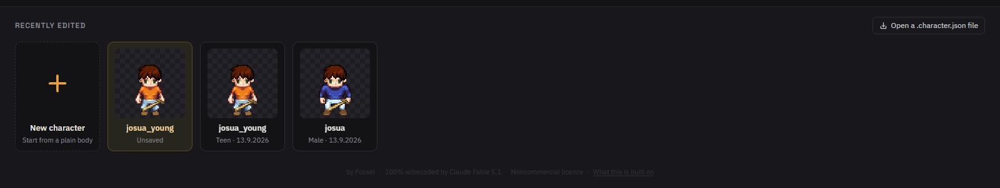
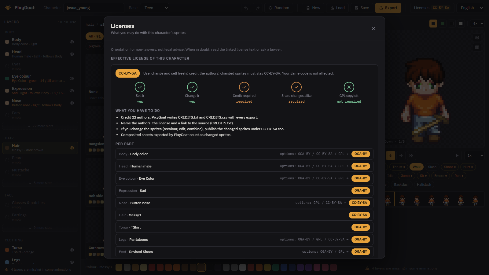
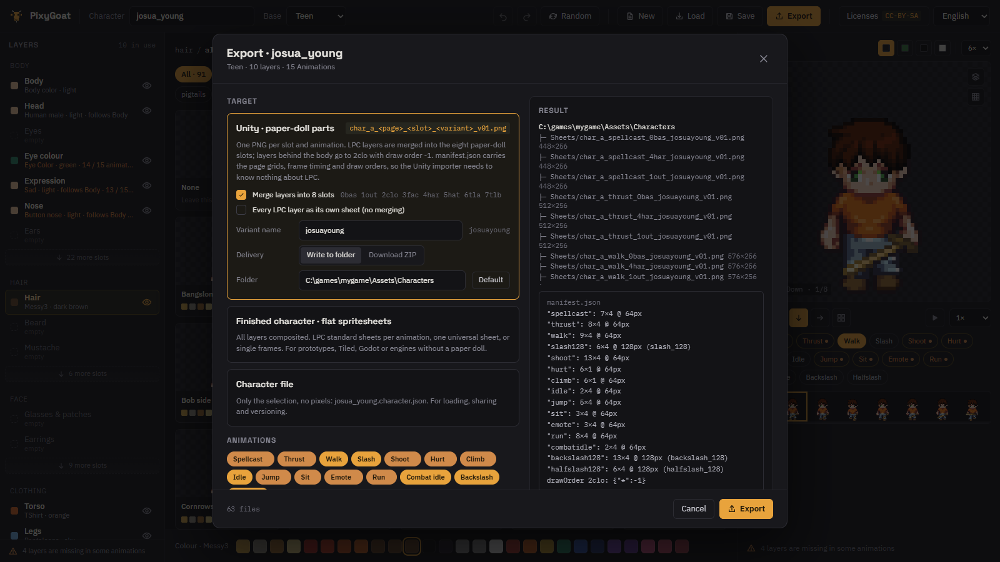

<div align="center">


# PixyGoat

**Build pixel characters, check them, ship them.**

Stack a character from 659 hand-drawn [LPC](https://lpc.opengameart.org/) parts,
watch all fifteen animations while you work, and export finished spritesheets or
paper-doll parts your engine can swap at runtime.
Runs on your own machine, in your own browser.


</div>


## What it does

- **Every part, filtered to what fits.** 659 parts across 6 body types. The
  catalogue greys out what your body type cannot wear instead of hiding it, and
  says which body type it belongs to when it collides.
- **Fifteen animations while you work.** Walk, run, the four attack sets,
  climbing, sitting — playing in the preview as you pick, with the frame strip
  underneath and any facing you like.
- **Licences you can read.** Every part carries a seal: may you sell it, must
  you credit, must changes stay open. Filter the catalogue down to terms you
  accept, and every export writes a matching `CREDITS.txt`.
- **Exports that keep working.** Flat spritesheets for prototypes, or
  paper-doll parts with a manifest so an engine can swap hair and weapons at
  runtime without a clip per garment.

## Install

Five steps, about ten minutes, most of it spent downloading sprites. Everything
stays on your machine; nothing is uploaded anywhere.

### 1. Install Node.js 22 or newer

```bash
node --version
```

If that prints anything below `v22`, install it from
[nodejs.org](https://nodejs.org/) (the LTS build will do) and open a new
terminal afterwards.

### 2. Get PixyGoat

```bash
git clone https://github.com/FosselDev/pixygoat.git
cd pixygoat
```

Without git: download the repository as a ZIP from GitHub, unpack it, and `cd`
into the unpacked folder.

### 3. Get the LPC sprites

The sprites are not part of this repository and never will be: they were drawn
by the LPC community and carry their own licences, so you fetch them from the
source.

PixyGoat reads the `spritesheets/` folder of the
[Universal LPC Spritesheet Character Generator](https://github.com/LiberatedPixelCup/Universal-LPC-Spritesheet-Character-Generator),
pinned to commit `e7fa0aee616` (2025-07-21). The catalogue is built against
exactly that snapshot; a newer one may hold parts it does not know.

That folder alone, at that commit. It is around 300 000 files: 0.55 GB of
data, but closer to 1.2 GB on disk, because hundreds of thousands of tiny
PNGs each round up to a full cluster.

```bash
git clone --filter=blob:none --no-checkout --sparse \
  https://github.com/LiberatedPixelCup/Universal-LPC-Spritesheet-Character-Generator.git lpc
cd lpc
git sparse-checkout set spritesheets
git checkout e7fa0aee616
cd ..
```

Without git, download the
[ZIP of that commit](https://github.com/LiberatedPixelCup/Universal-LPC-Spritesheet-Character-Generator/archive/e7fa0aee616f21d31b0f56b5dad96d761719b984.zip)
and keep its `spritesheets/` folder — that route pulls the whole repository, not
just the sprites.

Then either move that `spritesheets/` folder next to this README, or leave it
where it is and point PixyGoat at it in the next step.

### 4. Install the dependencies and start

```bash
npm install
npm start
```

`npm start` builds the app and runs the local server. If the sprites live
somewhere else, say so once — the flag works the same on every start:

```bash
npm start -- --sprites ../lpc/spritesheets
```

The first start scans the spritesheet folder — about a minute for 300 000 files
— and caches the catalogue in `.cache/`. Later starts take a few seconds. If
you ever swap the sprite folder for another snapshot, start once with
`npm start -- --rebuild`.

### 5. Open it

<http://127.0.0.1:4600>

The terminal keeps the server running; `Ctrl+C` stops it. Characters you save
land in `characters/`, exports in `exports/`.

<details>
<summary>Flags and environment variables</summary>

| Flag | Variable | Default |
|---|---|---|
| `--sprites <dir>` | `PIXYGOAT_SPRITES` | `./spritesheets` |
| `--port <n>` | `PIXYGOAT_PORT` | `4600` |
| `--host <addr>` | `PIXYGOAT_HOST` | `127.0.0.1` |
| `--characters <dir>` | `PIXYGOAT_CHARACTERS` | `./characters` |
| `--cache <dir>` | `PIXYGOAT_CACHE` | `./.cache` |
| | `PIXYGOAT_UNITY_DIR` | `./exports/unity` |
| | `PIXYGOAT_EXPORT_DIR` | `./exports/flat` |
| `--rebuild` | | force a catalogue rebuild |

</details>

<details>
<summary>Docker</summary>

```bash
docker compose up --build
```

`compose.yaml` mounts `./spritesheets`, `./characters` and `./exports`. Set
`PIXYGOAT_SPRITES_HOST` to use a spritesheet folder elsewhere.

</details>

<details>
<summary>It does not start</summary>

- **`EADDRINUSE ... 4600`** — something else already holds the port, most likely
  a PixyGoat you forgot to stop. Close it, or start with `--port 4601`.
- **`Sprites directory not found: ...`** — the path is wrong. `--sprites` wants
  the `spritesheets/` folder itself, not its parent, and it is printed in full
  so you can compare it with where the folder really is.
- **Parts are missing or the catalogue looks wrong** — you are probably on
  another snapshot than `e7fa0aee616`. Check out that commit and start once with
  `--rebuild`.

</details>

## Using it

### 1. Pick a character

The start screen scrolls down to your work: a new character from a plain body,
the unsaved draft you left behind, and everything in `characters/`. A
`.character.json` dropped anywhere on the window opens too.



### 2. Build it in the editor


Three columns, and you work from left to right:

- **Layers, left.** One row per slot — body, head, hair, torso, legs, and the
  rest behind *more slots*, 106 of them in all. Click a row to browse that
  slot; the eye hides a layer without removing it, and a row says so when its
  part is missing from some animations.
- **Catalogue, middle.** Every part for the selected slot, previewed on your
  character. Search by name, tag or colour, narrow it with the tag chips, and
  switch *Matching* to *All* to see parts your body type cannot wear. The row
  at the bottom recolours the selected part; `15/15` on a tile means it is
  drawn for all fifteen animations.
- **Preview, right.** The character animating. Pick the facing, the animation
  and the zoom, play or step through the frame strip, and use the buttons above
  for background, all four directions at once, and an exploded layer view.
- **Top bar.** Name and body type, undo and redo, *Random* for a whole
  character at once, and New / Load / Save / Export.

### 3. Check what you may do with it



*Licenses* reads the character back to you: the strictest licence on it, what
that obliges you to do, and which licence every single part contributes. The
filter at the bottom of the panel greys out everything in the catalogue whose
terms you do not accept — set it once and build without watching the seals.

### 4. Export



| Target | What you get |
|---|---|
| **Unity · paper-doll parts** | One PNG per slot and animation, plus `manifest.json` with the grid, frame cycle, frame time and draw order of every page. An importer builds pages, parts, clips and a prefab from it without knowing what LPC is. |
| **Flat spritesheets** | Every layer composited. One sheet per animation, one universal sheet, or single frames — for prototypes, Tiled, Godot, or any engine without a paper doll. |
| **Character file** | The selection, no pixels. For loading, sharing and versioning. |

Pick the animations you want, then write the files into a folder or download
them as a ZIP. Both sheet exports carry `character.json`, `CREDITS.txt` and
`CREDITS.csv` along with the pixels — the credits are written every time, not
on request.

### Keyboard

| Key | In the editor |
|---|---|
| `Space` | play / pause |
| `←` `→` `↑` `↓` | facing |
| `1`–`8` | zoom |
| `Ctrl+Z` / `Ctrl+Y` | undo / redo |
| `Ctrl+S` / `Ctrl+O` / `Ctrl+E` | save / load / export |

## Development

```bash
npm run dev        # server on 4600 with reload, Vite app on 5173
npm test           # core unit tests
npm run typecheck
npm run catalog    # build the catalogue on the command line
```

`packages/core` holds the catalogue model, compositing, export planning and
licence analysis, with no DOM and no Node APIs; `packages/server` is a Fastify
server for the scan, the catalogue, sprites, character storage and file export;
`packages/app` is the Preact UI. Data lives in `data/` and `locales/`.

- [docs/implementation-plan.md](docs/implementation-plan.md) — decisions, architecture, milestones
- [docs/unity-export.md](docs/unity-export.md) — export format, the Unity importer, and what is not general yet

## Licence and credits

PixyGoat is under the [PolyForm Noncommercial License 1.0.0](LICENSE): use it,
change it and pass it on for anything noncommercial, and ask first if you want
to earn money with the tool itself. Making a game with it is not earning money
with the tool.

**The art is not mine and not covered by that.** Every sprite was drawn by
somebody in the LPC community and carries its own licence — CC0, CC-BY, CC-BY-SA,
OGA-BY or GPL. The strictest part on a sheet sets the rules for that sheet, the
in-app licence panel explains what each one allows, and every export writes the
credits next to the files. The sheet definitions under `data/definitions/` come
from the [Universal LPC Spritesheet Character Generator](https://github.com/LiberatedPixelCup/Universal-LPC-Spritesheet-Character-Generator)
and carry the artists' credits. Third-party npm packages are listed in
[THIRD_PARTY_LICENSES.md](THIRD_PARTY_LICENSES.md).

Not a condition, only a wish: if PixyGoat helped you make something, a mention
of Fossel in your credits is appreciated.
